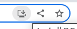

<p align="center"><a href="https://analytics.caspercommunity.io" target="_blank"></a></p>

## About Blockchain Authenticator

Webapp to generate TOTP (Time based One-Time Password) password.

The secret code needed to generate the OTP (One-Time Password) can be stored on the blockchain of your choice.<br>
In our case, we've started with the Casper's Blockchain. For that reason, we've writed a [basic smartcontrat]( https://github.com/caspercommunityio/blockchain-authenticator-contract)

The last version of this smartcontract is include in the sources (see : src/assets)

## Live Version

You must have the Casper Signer installed to use this app. <br>If you don't know how to use the Signer, please [follow these instructions](https://docs.cspr.community/docs/user-guides/SignerGuide.html)

You can access the mainnet app at https://authenticator.caspercommunity.io

## How to install

The webapp is build using the [Ionic Framework](https://ionicframework.com/)<br>
You must have [Node & npm](https://nodejs.org/en/) and [Git](https://git-scm.com/downloads).

We use the following version of node :
```
node --version
v16.15.1
```

### Install dependecies
```
npm install -g @ionic/cli
git clone git@github.com:caspercommunityio/blockchain-authenticator-app.git
cd blockchain-authenticator-app
npm install
```

### Environment settings
```
export const environment = {
  production: false,
  casperRPC: 'https://node-clarity-testnet.make.services/rpc', //RPC url to retrieve and send data on the blockchain
  casperEnv: 'casper-test', //casper (for mainnet) or casper-test (for testnet)
  bcGasFeesMin: 0, //minimum fees for the transaction with the blockchain
  bcGasFeesMax: 5, //maximum fees for the transaction with the blockchain
  bcGasFeesAsDefault: 1.5, // default fees for the transaction with the blockchain (can be changed within the app)
  version: "local"
};
```
You have 2 environment files in the folder **/src/environments** :
- environment.ts
- envionrment.prod.ts

The file "environment.ts" will be used for the dev deployment.<br>
The file "environment.prod.ts" will be used when you build the app for production.

Note that the property "version" is automatically set when building the app for a deployment.

### Start the app locally
```
ionic serve
```
### Build the web version
```
ionic build --prod
```

It will generate a "www" folder that you can upload to any web hosting.

## How to test

Run the following command :

```
npm test
```

The result should be like this :


Sometimes Jasmine generates an error and all bullets are green.
If it's the case, run severals times the tests (and/or run in debug too).<br>
I think it's something with the Ionic framework.

## User's guide

### How to add an authenticator code via the camera

You can scan any QRCode with the camera of your device. But the app only recognize OTP qrcode and Export Qrcode.

Once one of these 2 qrcode is recognize, the app will decode it and do the job.

### How to add an authenticator code manually

To add or edit an authenticator code, click on the menu and select the menu item « Add Manually ».

You must provide a name and an authenticator code.<br>
Once it’s done, you can validate.<br>
The new code will appear at the bottom of the list and give you the OTP password.

### How to manage an authenticator code

To manage the code, click on the menu icon and then on the menu item « Manage »

A new page will appear with news icons.<br>
On the left, you can reorder the elements.<br>
On the right, you can edit the name of the code or delete the code by clicking on the trash icon.

### How to (de)synchronize authenticator codes on the Casper's blockchain

**The (de)synchronization with the blockchain is only possible with a PC using the Casper Signer extension.**

If you don't know how to use the Signer, please follow these instructions : https://docs.cspr.community/docs/user-guides/SignerGuide.html

On the app, click on the menu button. Then select the option « Blockchain Sync. ».

A new page will appear where you can select the codes you want to (de)sync.<br>
You can (de)sync. up to 5 codes at a time.<br>
More will may cause an issue because length of the parameters cant exceed 1024bytes.

<br>

Once you have selected yours codes, click on the icon to « sync » (5th icon) or « desync » (4th icon).

The Signer will open and you’ll have the possibility to sign (or not) the transaction and send it on the blockchain.

If you have an issue with the « out of gas » message, you can adapt the fees with the icon « fees ». Then try again…

Menu Items :

- Show the blockchain parameters (gas fees, named key)
- Get the public key from the Casper's signer
- Desynchronize all secret codes
- Desynchronize the selected secret codes
- Syncrhonize the selected secret codes
- close the menu

### How to change the passphrase

The passphrase is used to (de)encrypt the data stored on the blockchain.

You can set the passphrase manually or generate a new one.

You dont have to memorize your passphrase. You just have to use the Backup functionnality.

### How to backup your data

To backup your data, you have to use the "Export"  functionality.

It will generate a QRCode with all your infos.

### How to setup(restore) a new device

The easiest way to setup a new device is to use the "Backup functionality".

You generate a backup (using the "Export" functionality) and store it somewhere in a safe place. Then scan this QRCode on the new device.

**You must use it in that way if you want to setup a smartphone/tablet**

If you want to restore your data on a desktop, you can use the procedure just above or following these steps :

- Setup the passphrase used to store the secret codes
- Click on "Blockchain Sync." menu item
- Select the "Parameters" and define the correct named key
- Click on the "Wallet" menu item, it will select the current public key associated to the casper signer. If it's not the correct one, select it in the casper signer and click again on the "wallet" menu item.

Note : If you use this procedure, the secret codes not sync. with the blockchain will be lost.

### What the colors mean

You can easily know if the authenticator code is sync with the blockchain with the color.

If the code is « gray » that means that the code is successfully sync with the blockchain.

If the code is « orange » that means that the code is not yet sync with the blockchain.

### How to copy the code to the clipboard

You can copy the code to the clipoard by clicking on it. A message will appear to confirm it.

### What to do to use the app with another blockchain

If you want to use this app with another blockchain, you have first to write the [associated smartcontract](https://github.com/caspercommunityio/blockchain-authenticator-contract).

Then you have to adapt the code of the "src/app/services/blockchain.service.ts".

This class contains the call to the smartcontract (to write in the blockchain) and the retrieve data (to get the code back from the blockchain).

Once the contract is builded, put it in the folder "src/assets"

### Can I add new codes on my phone before my PC

It’s not mandatory to add only new codes on your PC.

You can add new codes on your phone and then use the « export » functionality to sync the data between your PC and your mobile.

Once it’s sync on the blockchain, you’ll see the color changed in the interface.

### How to install Blockchain Authenticator as a PWA (Progressive Web App) on your desktop, smartphone (iOS and Android)



On chrome, you'll have a small desktop icon on the right side of the URL adress.

Click on it. It will display a popup asking you to install or not the app.


Once installed, you can retrieve the application back like any other application.<br>
In my case, I use ubuntu and I can find it back


On your smartphone, just go to the website and add it on your home screen.

## License

The Blockchain Authenticator App is open-sourced software licensed under the [MIT license](https://opensource.org/licenses/MIT).

The Ionic framework is open-sourced software licensed under the [MIT license](https://opensource.org/licenses/MIT).
